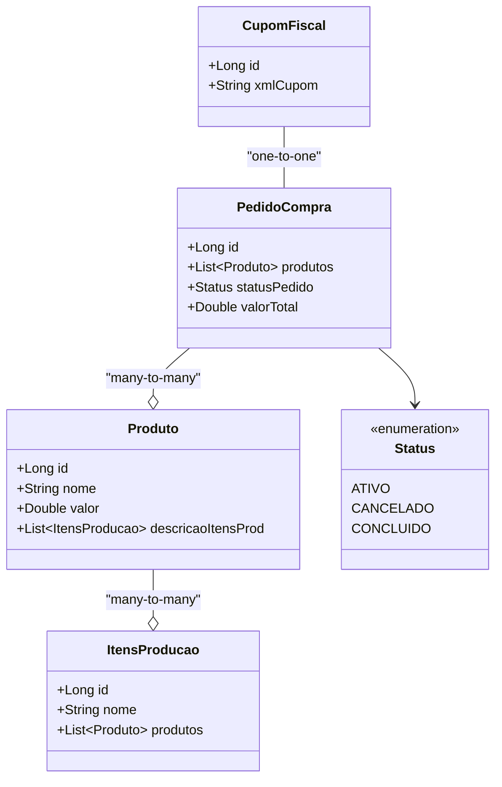

# Cafeteria_Lumens

Sistema de gerenciamento para cafeteria desenvolvido em Spring Boot como parte dos estudos do Bootcamp DIO Deal - Spring Boot e Angular (17+)

## 🌟 Visão Geral do Projeto

A Cafeteria Lumens é um sistema completo para gerenciamento de pedidos em uma cafeteria, oferecendo:

- Cardápio digital com todos os produtos disponíveis
- Controle completo do ciclo de vida dos pedidos
- Geração automática de cupons fiscais
- Gestão dos itens que compõem cada produto

## 🛠️ Stack Tecnológica

### Backend
- **Linguagem**: Java 17+
- **Framework**: Spring Boot 3.4.4
- **Persistência**: 
  - JPA/Hibernate
  - Banco H2 (para desenvolvimento)
- **Containerização**: Docker
- **Build**: Maven0

## 📋 Funcionalidades Principais

### 🍵 Gestão de Produtos
- Cadastro automático dos produtos ao iniciar a aplicação
- Consulta de todos os produtos disponíveis (`findAll`)
- Busca de produtos específicos por nome (`findByName`)
- Detalhamento dos ingredientes de cada produto

### 🧾 Fluxo de Pedidos
- Criação de novos pedidos
- Acompanhamento do status do pedido (Ativo, Cancelado, Concluído)
- Possibilidade de cancelamento do pedido
- Cálculo automático do valor total

### 🧾 Cupom Fiscal
- Geração automática ao concluir o pedido
- Registro de todos os itens consumidos
- Valor total da compra
- Status final do pedido (CONCLUIDO)

## 🔍 Diagrama de Classes



## 📚 Contexto de Aprendizado

Este projeto foi desenvolvido como parte do **Bootcamp DIO Deal - Spring Boot e Angular (17+)**, com os seguintes objetivos de aprendizagem:

- Praticar os conceitos de Spring Boot 3.x
- Implementar arquitetura RESTful
- Trabalhar com persistência usando JPA/Hibernate
- Utilizar bancos de dados em memória (H2)
- Deploy na Nuvem com o Railway
- Implementar boas práticas de desenvolvimento

## 🐳 Dockerização

O projeto está configurado para execução em containers Docker:

```bash
# Build da imagem
docker build -t cafeteria-lumens .

# Executar o container
docker run -p 8080:8080 cafeteria-lumens
